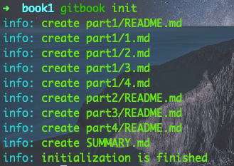
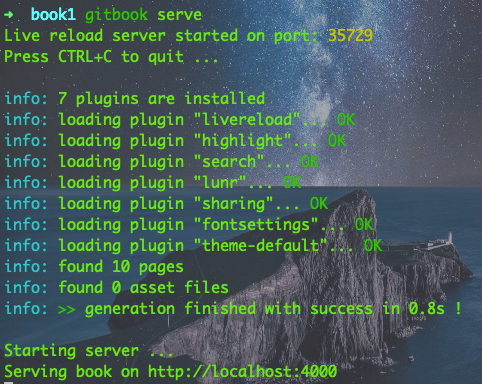
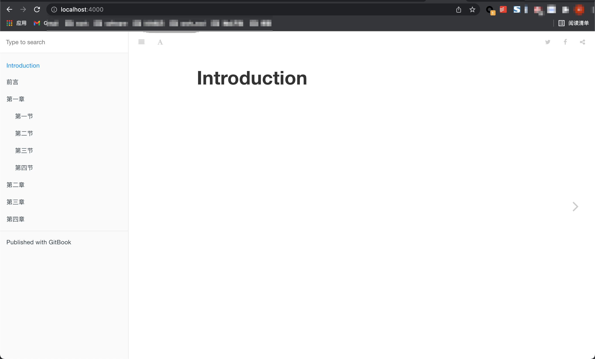

# Gitbook配置--开启写作之路 

在本文中，将使用Gitbook + Github pages搭建属于自己的Blog，终端环境为zsh，设备为Macbook. 

<!-- toc -->

## 1.node.js 安装

gitbook作为一个前端写作框架，需要nodejs提供页面渲染支持，以及npm包管理工具来提供自定义插件进行使用。

由于gitbook作者目前已经转向gitbook的商业化运作，因此gitbook目前公开的部署版本已经是几年前了，所以高版本的node部署起来会有一定的问题，建议如果不需要使用nodejs新特性的朋友，可以安装6.x版本[node.js 6.x](https://registry.npmmirror.com/binary.html?path=node/latest-v6.x/) . 当然，如果需要跟随新特性的话，可以使用homebrew来进行安装，不过会存在一部分问题，我们可以一起来解决一下, 同时，有一部分插件随着nodejs版本的升高也无法使用，因此本文中homebrew选用的nodejs版本为node@12. 

> ``` brew search node```
>
> ```brew install node@12 ```

下载完成之后，按照提示执行下列命令, 并使之生效即可.

> ```echo 'export PATH="/usr/local/opt/node@16/bin:$PATH"' >> ~/.zshrc```

查看node版本，成功安装即可进行下一步.

> ```node -v```

## 2.Gitbook安装

nodejs环境配置完成之后，即可通过npm工具下载安装gitbook

> ```npm install gitbook-cli -g```

安装完成之后，查看gitbook版本，即会安装gitbook工具

> gitbook -V

### warning 

此时，可能会出现如下错误，主要是由于node版本较高导致的


有两种解决方案

- 打开finder，通过路径找到polyfills.js文件，其中，可以看到287行代码处于```statFix``` 方法中，其调用位置在62-64行，注释中阐述该方法主要是旧版本的修复逻辑，因此可以直接将调用位置注释掉，即可解决该问题.
- 通过降低nodejs版本，建议降至7.x以下，该方法也是网络上的主流方法，但是个人感觉有点削足适履.

## 3.Gitbook部署

### 初始化

gitbook安装完成后，即可通过gitbook命令初始化gitbook目录

> ```gitbook init```


其中README为项目文档，SUMMARY.md为目录文档，在SUMMARY中更新目录完成后，即可直接通过init命令创建该目录中的文件

```bash
# Summary

* [Introduction](README.md)
* [前言](readme.md)
* [第一章](part1/README.md)
    * [第一节](part1/1.md)
    * [第二节](part1/2.md)
    * [第三节](part1/3.md)
    * [第四节](part1/4.md)
* [第二章](part2/README.md)
* [第三章](part3/README.md)
* [第四章](part4/README.md)
```

上述目录创建完成后执行命令



### warning 

在gitbook初始化过程过程中，还会出现一个问题，该问题是由于nodejs版本过高导致的，发现了吗，其实由于gitbook公开版本久未更新的缘故，还是使用老版本的配套环境更加方便。


### 构建

初始化之后，可以通过以下命令来进行构建，构建完成后会生成_book目录，其中存储的即为默认生成的静态网页

> ```gitbook build```

### 部署

构建完成后，通过以下命令，即可启动gitbook服务

> ```gitbook serve```



通过 [http://localhost:4000](http://localhost:4000) 即可访问新建的gitbook电子书



## 4.Gitbook插件

### book.json

一般项目配置中都会有一个核心的配置文件，gitbook项目中即有一个book.json来管理整个gitbook项目，以下是我博客项目的配置文件

```json
{
    "author": "irick<happyirick@gmail.com>",
    "description": "A GitBook Blog for irick",
    "extension": null,
    "generator": "site",
    "language":"zh-hans",
    "isbn": "",
    "links": {
        "sharing": {
            "all": null,
            "facebook": null,
            "google": null,
            "twitter": null,
            "weibo": null
        },
        "sidebar": {
            "About me":"https://github.com/HappyiRick",
            "irick's Blog": "https://happyirick.github.io/"
        }
    },
    "output": null,
    "pdf": {
        "fontSize": 12,
        "footerTemplate": null,
        "headerTemplate": null,
        "margin": {
            "bottom": 36,
            "left": 62,
            "right": 62,
            "top": 36
        },
        "pageNumbers": false,
        "paperSize": "a4"
    },
    "plugins": [
        "-sharing",
        "-lunr", 
        "-search",
        "-fontsettings",
        "multipart",
        "simple-page-toc",
        "page-toc-button",
        "github",
        "advanced-emoji",
        "search-pro",
        "code",
        "copy-code-button",
        "chapter-fold",
        "splitter",
        "expandable-chapters",
        "back-to-top-button",
        "lightbox",
        "toggle-chapters",
        "anchors",
        "baidu-tongji",
        "tbfed-pagefooter",
        "insert-logo"
    ],
    "pluginsConfig": {
        "simple-page-toc": {
            "maxDepth": 3,
            "skipFirstH1": true
        },
        "page-toc-button": {
            "maxTocDepth": 2,
            "minTocSize": 2
        },
        "github": {
            "url": "https://github.com/HappyiRick"
        },
        "code": {
            "copyButtons": true
        },
        "tbfed-pagefooter": {
            "copyright":"Copyright &copy happyirick 2022",
            "modify_label": "Post time:",
            "modify_format": "YYYY-MM-DD HH:mm:ss"
        },
        "baidu-tongji": {
            "token": "5370d7bf584be5cfd91dd00fcb82ba67"
        },
        "insert-logo":{
            "url":"https://avatars.githubusercontent.com/u/16249555?s=400&u=45da22298bf8c55f726807d1ba94740343d14f20&v=4",
            "style":"background:none;min-height:196px;max-height:196px"
        }
    },
    "title": "irick's Blog",
    "variables": {}
}
```

其中```plugins``` 部分，则表示我们本项目的插件引用情况，追加插件名即可添加插件，通过在插件名前增加 - 号则可删去该插件，通过以下命令来进行安装

> ```gitbook install```

## 总结

gitbook是一款很方便的电子书生成浏览工具， 搭配一款合适的markdown写作工具即可实现高效的写作，非常感谢作者提供的这款工具

<!-- endtoc -->

